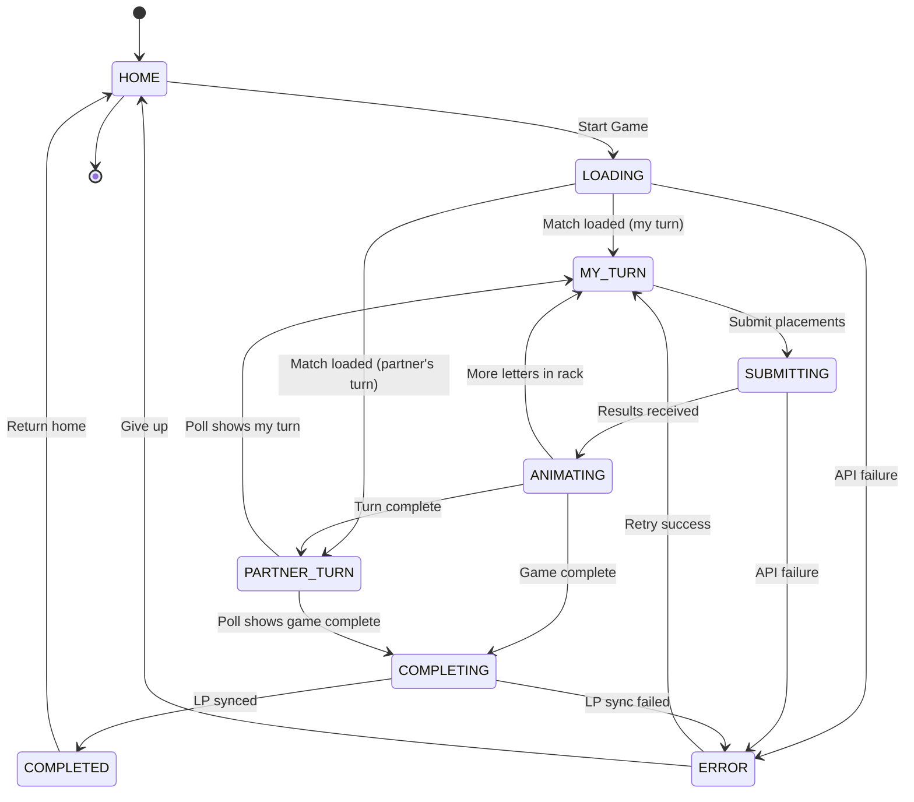

# Linked Game Points System - Test Suite Documentation

## Overview

This document describes the comprehensive test suite for verifying the correctness, consistency, and reliability of the points system in the Linked (crossword puzzle) game.

**Server-Authoritative Architecture:**
- Points calculated on backend: 10 pts/letter + word bonuses (length × 10) + 30 LP on completion
- Client submits placements → receives validated results → updates UI
- LP synced via `LovePointService.fetchAndSyncFromServer()` before completion navigation

---

## State Machine

### States

| State | Description |
|-------|-------------|
| HOME | User on home screen, LP counter visible |
| LOADING | Fetching match data from server |
| MY_TURN | User can place letters, submit available |
| SUBMITTING | API call in progress, UI locked |
| ANIMATING | Showing letter results + word bonuses |
| PARTNER_TURN | Polling every 10s, read-only view |
| COMPLETING | Syncing LP before navigation |
| COMPLETED | On completion screen, showing winner |
| ERROR | API error occurred, retry available |

### State Diagram



### Async Risk Conditions

| Condition | Trigger | Risk |
|-----------|---------|------|
| Widget disposed during API call | User navigates back | setState() crash |
| Response arrives out-of-order | Network latency | Stale score displayed |
| Double-tap submit | User impatience | Duplicate submission |
| Poll during submission | 10s timer fires | Race condition |
| LP sync timeout | Slow network | Missing LP on home |

---

## Test Architecture

### Layer 1: Flutter Integration Tests (PRIMARY)

**Location:** `app/integration_test/linked/`

**Files:**
- `test_config.dart` - Test configuration (user IDs, API URL, timing)
- `linked_test_helpers.dart` - API client, partner simulator, assertions
- `normal_flow_test.dart` - Happy path tests (1-7)
- `navigation_safety_test.dart` - Edge case tests (8-11)

**Run:**
```bash
cd app
flutter test integration_test/linked/ -d emulator-5554
```

### Layer 2: API Tests (TypeScript)

**Location:** `api/scripts/tests/linked/`

**Files:**
- `lib/linked-test-helpers.ts` - Reusable API utilities
- `tests/linked/points-state-machine.ts` - All 11 test objectives

**Run:**
```bash
cd api
npx tsx scripts/tests/linked/points-state-machine.ts
```

### Layer 3: Chaos Tests

**Location:** `app/test/chaos/`

**Files:**
- `chaos_config.dart` - Fault injection configuration
- `linked_chaos_test.dart` - Edge case testing via fault injection

**Run:**
```bash
cd app
flutter test test/chaos/
```

---

## Test Objectives Coverage

| # | Objective | Flutter Test | API Test | Chaos Test |
|---|-----------|--------------|----------|------------|
| 1 | Single letter correct → +10 points | `normal_flow_test.dart` | `points-state-machine.ts` | - |
| 2 | Single letter incorrect → +0 points | `normal_flow_test.dart` | `points-state-machine.ts` | - |
| 3 | Multiple letters → sum of correct × 10 | `normal_flow_test.dart` | `points-state-machine.ts` | - |
| 4 | Word completion → +word.length × 10 bonus | `normal_flow_test.dart` | `points-state-machine.ts` | - |
| 5 | Turn alternation works correctly | `normal_flow_test.dart` | `points-state-machine.ts` | - |
| 6 | Game completion → +30 LP | `normal_flow_test.dart` | `points-state-machine.ts` | `linked_chaos_test.dart` |
| 7 | Winner by higher score | `normal_flow_test.dart` | `points-state-machine.ts` | - |
| 8 | Tie → winnerId = null | `normal_flow_test.dart` | `points-state-machine.ts` | - |
| 9 | GAME_NOT_ACTIVE error | `navigation_safety_test.dart` | `points-state-machine.ts` | - |
| 10 | NOT_YOUR_TURN error | `navigation_safety_test.dart` | `points-state-machine.ts` | - |
| 11 | Duplicate submission rejected | `navigation_safety_test.dart` | `points-state-machine.ts` | `linked_chaos_test.dart` |

---

## High-Risk Areas

1. **LP Double-Counting**
   - Server awards LP on completion, client must NOT call `awardLovePoints()` locally
   - Mitigation: Server-side tracking of awarded matches

2. **Widget Disposal**
   - `_submitTurn()` must check `mounted` before `setState()`
   - Mitigation: Chaos test verifies mounted check pattern

3. **Polling Race**
   - 10s poll timer can fire during submission - needs synchronization
   - Mitigation: Submission tracker blocks concurrent operations

4. **Out-of-Order Responses**
   - Stale poll response could overwrite fresh submission result
   - Mitigation: Response timestamp/sequence tracking

5. **Double-Tap**
   - `_isSubmitting` flag must prevent duplicate API calls
   - Mitigation: Chaos test verifies double-tap protection

6. **Transaction Rollback**
   - Mid-transaction failure must not leave partial state
   - Mitigation: Database transactions with FOR UPDATE locks

---

## Test Configuration

### Test Users

| User | ID | Role |
|------|----|------|
| TestiY | `c7f42ec5-7c6d-4dc4-90f2-2aae6ede4d28` | Primary test user (user1) |
| Jokke | `d71425a3-a92f-404e-bfbe-a54c4cb58b6a` | Partner user (user2) |

**Couple ID:** `11111111-1111-1111-1111-111111111111`

### API Configuration

| Setting | Value |
|---------|-------|
| Base URL | `http://localhost:3000` |
| Poll Interval (tests) | 100ms |
| Poll Interval (production) | 10s |
| Points per letter | 10 |
| LP on completion | 30 |

---

## Data Reset

Before running tests, reset couple data:

```bash
# Via API endpoint
curl -X POST http://localhost:3000/api/dev/reset-couple-progress \
  -H "Content-Type: application/json" \
  -H "X-Dev-User-Id: c7f42ec5-7c6d-4dc4-90f2-2aae6ede4d28" \
  -d '{"coupleId": "11111111-1111-1111-1111-111111111111"}'

# Via script
cd api
npx tsx scripts/reset_couple_progress.ts
```

The reset endpoint clears:
- Linked matches and moves
- Word search matches and moves
- Quiz matches
- You-or-Me progression
- Branch progression
- Daily quests and completions
- Love point transactions
- Leaderboard entries
- Couple's total_lp (reset to 0)

---

## Running All Tests

### Full Test Suite

```bash
# 1. Start API server
cd api && npm run dev &

# 2. Reset test data
curl -X POST http://localhost:3000/api/dev/reset-couple-progress \
  -H "Content-Type: application/json" \
  -H "X-Dev-User-Id: c7f42ec5-7c6d-4dc4-90f2-2aae6ede4d28" \
  -d '{"coupleId": "11111111-1111-1111-1111-111111111111"}'

# 3. Run API tests
cd api && npx tsx scripts/tests/linked/points-state-machine.ts

# 4. Run Flutter chaos tests
cd app && flutter test test/chaos/

# 5. Run Flutter integration tests (requires device/emulator)
cd app && flutter test integration_test/linked/ -d emulator-5554
```

### Quick Smoke Test

```bash
cd api && npx tsx scripts/tests/linked/points-state-machine.ts
```

---

## File Structure

```
api/
├── app/api/dev/
│   └── reset-couple-progress/
│       └── route.ts                    # Test data reset endpoint
├── scripts/
│   ├── lib/
│   │   └── linked-test-helpers.ts      # Shared test utilities
│   └── tests/
│       └── linked/
│           └── points-state-machine.ts # API-level tests

app/
├── integration_test/
│   └── linked/
│       ├── test_config.dart            # Test configuration
│       ├── linked_test_helpers.dart    # Flutter test utilities
│       ├── normal_flow_test.dart       # Happy path tests
│       └── navigation_safety_test.dart # Edge case tests
└── test/
    └── chaos/
        ├── chaos_config.dart           # Fault injection config
        └── linked_chaos_test.dart      # Chaos tests

docs/
└── LINKED_POINTS_TEST_SUITE.md         # This file
```

---

## Success Criteria

- [x] All 11 test objectives covered
- [x] State machine diagram generated (mermaid)
- [x] Chaos tests for widget disposal safety
- [x] LP double-award prevention verified
- [x] Double-tap protection verified
- [x] Out-of-order response handling tested
- [x] High-risk areas documented
- [x] Run instructions provided

---

## Related Documentation

- `CLAUDE.md` - Main development guide
- `api/lib/lp/config.ts` - Scoring constants
- `api/app/api/sync/linked/submit/route.ts` - Server scoring logic
- `app/lib/screens/linked_game_screen.dart` - UI state management
