# Quiz & Daily Quest Sync System

**Complete technical documentation of the cross-device data synchronization system**

---

## Table of Contents

1. [System Overview](#system-overview)
2. [Architecture Components](#architecture-components)
3. [Data Flow Diagram](#data-flow-diagram)
4. [Detailed Step-by-Step Flow](#detailed-step-by-step-flow)
5. [Key Files and Their Roles](#key-files-and-their-roles)
6. [Firebase RTDB Structure](#firebase-rtdb-structure)
7. [Synchronization Mechanisms](#synchronization-mechanisms)
8. [Troubleshooting](#troubleshooting)

---

## System Overview

The quiz/quest sync system enables two partners (Bob and Alice) to complete daily quizzes together on separate devices. The system ensures:

- ✅ **Real-time visibility**: Each user sees when their partner completes a quiz
- ✅ **Automatic synchronization**: Quiz answers and completion status sync across devices via Firebase RTDB
- ✅ **Love Points (LP) rewards**: Both users earn 30 LP when both complete the same quiz
- ✅ **No duplicate data**: Both users see the same quiz questions (synced quest IDs)

### Key Technologies

- **Firebase Realtime Database (RTDB)**: Real-time sync between devices
- **Hive**: Local device storage (cache for offline access)
- **Firebase Listeners**: Background listeners for partner updates
- **Polling Pattern**: Active polling on waiting screen to detect completion

---

## Architecture Components

```
┌─────────────────────────────────────────────────────────────┐
│                    Firebase RTDB (Cloud)                     │
│                                                              │
│  /quiz_sessions/{emulatorId}/{sessionId}                    │
│  /daily_quests/{coupleId}/{dateKey}                         │
│  /quiz_progression/{coupleId}                               │
└─────────────────────────────────────────────────────────────┘
                         ▲           ▲
                         │           │
        ┌────────────────┘           └────────────────┐
        │                                             │
        │ Firebase Listener                Firebase Listener
        │ (Background)                     (Background)
        ▼                                             ▼
┌──────────────────┐                          ┌──────────────────┐
│   Alice Device   │                          │    Bob Device    │
│  (emulator-5554) │                          │    (web-bob)     │
│                  │                          │                  │
│  Hive Storage    │                          │  Hive Storage    │
│  QuizService     │                          │  QuizService     │
│  Waiting Screen  │◄─────(Polling)──────────►│  Waiting Screen  │
└──────────────────┘                          └──────────────────┘
```

---

## Data Flow Diagram

```mermaid
sequenceDiagram
    participant Alice as Alice Device<br/>(emulator-5554)
    participant AliceHive as Alice Hive<br/>(Local Storage)
    participant Firebase as Firebase RTDB<br/>(Cloud)
    participant BobListener as Bob Background<br/>Listener
    participant BobHive as Bob Hive<br/>(Local Storage)
    participant Bob as Bob Device<br/>(web-bob)

    Note over Alice,Bob: 📅 STEP 1: Daily Quest Generation (First User)

    Alice->>AliceHive: Check for today's quests
    AliceHive-->>Alice: No quests found
    Alice->>Firebase: Check /daily_quests/{coupleId}/{dateKey}
    Firebase-->>Alice: No quests exist yet
    Alice->>Alice: Generate new quests (quiz, word ladder, etc.)
    Alice->>AliceHive: Save quests locally
    Alice->>Firebase: Upload quests with IDs to /daily_quests/

    Note over Alice,Bob: Bob launches app shortly after

    Bob->>BobHive: Check for today's quests
    BobHive-->>Bob: No quests found
    Bob->>Firebase: Check /daily_quests/{coupleId}/{dateKey}
    Firebase-->>Bob: ✅ Quests exist! (generated by Alice)
    Bob->>BobHive: Save quests locally with SAME IDs

    Note over Alice,Bob: Both users now have identical quest IDs ✅

    Note over Alice,Bob: 🎯 STEP 2: Bob Starts Quiz First

    Bob->>Bob: Tap quiz quest card
    Bob->>BobHive: Load questions for quiz contentId
    Bob->>Bob: Display QuizIntroScreen
    Bob->>Bob: User taps "Start Quiz"
    Bob->>Bob: Display QuizScreen (5 questions)

    Note over Bob: Bob answers all 5 questions

    Bob->>Bob: User taps "Submit Answers"
    Bob->>BobHive: Create QuizSession with answers
    Bob->>Firebase: Sync session to /quiz_sessions/web-bob/{sessionId}
    Bob->>BobHive: Mark quest as completed for Bob (userCompletions[Bob]=true)
    Bob->>Firebase: Update /daily_quests/.../completions/{questId}/Bob = true
    Bob->>Bob: Navigate to QuizWaitingScreen

    Note over Bob: 💭 Bob now sees:<br/>"You: Answered ✅"<br/>"Alice: Pending ⏳"

    Note over Alice,Bob: 🔔 STEP 3: Alice Sees Bob's Completion

    BobListener->>Firebase: onValue listener detects new session
    Firebase-->>BobListener: New session data from Bob
    BobListener->>AliceHive: Save Bob's session locally

    Note over Alice: Alice's quest card updates automatically

    Alice->>AliceHive: Refresh home screen
    AliceHive-->>Alice: Quest shows Bob completed
    Alice->>Alice: Quest card shows "Bob: Answered ✅"

    Note over Alice,Bob: 🎯 STEP 4: Alice Completes Quiz

    Alice->>Alice: Tap quiz quest card
    Alice->>AliceHive: Load questions (SAME contentId as Bob)
    Alice->>Alice: Display QuizIntroScreen
    Alice->>Alice: User taps "Start Quiz"
    Alice->>Alice: Display QuizScreen (5 questions)

    Note over Alice: Alice answers all 5 questions

    Alice->>Alice: User taps "Submit Answers"
    Alice->>AliceHive: Create QuizSession with answers
    Alice->>Firebase: Sync session to /quiz_sessions/emulator-5554/{sessionId}
    Alice->>AliceHive: Mark quest as completed for Alice (userCompletions[Alice]=true)
    Alice->>Firebase: Update /daily_quests/.../completions/{questId}/Alice = true

    Note over Alice: ✨ BOTH users completed - trigger completion calculation

    Alice->>Alice: Detect both users completed (2 answers)
    Alice->>Alice: Calculate match percentage
    Alice->>Alice: Award 30 LP to Alice
    Alice->>Firebase: Award 30 LP to Bob via Cloud Function
    Alice->>AliceHive: Update session.lpEarned = 30, status = "completed"
    Alice->>Firebase: Sync completed session to Firebase

    Note over Alice,Bob: 🔔 STEP 5: Bob's Waiting Screen Detects Completion

    Bob->>Firebase: Poll /quiz_sessions/emulator-5554/{sessionId} (every 3s)
    Firebase-->>Bob: ✅ Session completed! (isCompleted=true, lpEarned=30)
    Bob->>BobHive: Update local session
    Bob->>Bob: Cancel polling timer
    Bob->>Bob: Navigate to QuizResultsScreen

    Note over Bob: 🎉 Bob sees:<br/>"Match: X%"<br/>"+30 LP Earned!"

    Alice->>Alice: Navigate to QuizResultsScreen

    Note over Alice: 🎉 Alice sees:<br/>"Match: X%"<br/>"+30 LP Earned!"

    Note over Alice,Bob: ✅ Both users see results, earned 30 LP each
```



---

## Detailed Step-by-Step Flow

### STEP 1: Daily Quest Generation (First User Launches App)

**Scenario**: Alice launches app at 8:00 AM, Bob is still asleep.

1. **Alice's app startup** (`main.dart:64-68`):
   ```dart
   await QuizService().startListeningForPartnerSessions();
   ```
   - Sets up Firebase listener for Bob's quiz completions
   - Listener runs in background throughout app session

2. **Quest sync check** (`home_screen.dart` → `DailyQuestService`):
   - Alice's app calls `QuestSyncService.syncTodayQuests()`
   - Checks Firebase path: `/daily_quests/{coupleId}/{dateKey}`
   - Result: **No quests exist** (Alice is first user today)

3. **Quest generation** (`daily_quest_service.dart`):
   - Generates 3 main quests + side quests
   - Each quest gets unique ID (e.g., `quest_2025-01-13_0`, `quest_2025-01-13_1`)
   - Saves locally to Alice's Hive storage

4. **Firebase upload** (`quest_sync_service.dart:121-160`):
   ```dart
   await saveQuestsToFirebase(
     quests: generatedQuests,
     currentUserId: alice.id,
     partnerUserId: bob.id,
   );
   ```
   - Uploads quest data to `/daily_quests/alice_bob/2025-01-13/`
   - Structure:
     ```json
     {
       "quests": [
         {
           "id": "quest_2025-01-13_0",
           "questType": 0,
           "contentId": "classic_quiz_001",
           "sortOrder": 0,
           "isSideQuest": false
         }
       ],
       "generatedBy": "alice",
       "generatedAt": 1705147200000
     }
     ```

5. **Bob launches app** (later at 9:00 AM):
   - `QuestSyncService.syncTodayQuests()` checks Firebase
   - Result: **Quests exist!** (generated by Alice)
   - Downloads quest data from Firebase
   - **Preserves original quest IDs** from Alice's generation
   - Saves to Bob's Hive storage with **SAME IDs**

**Critical Result**: Both users have identical quest IDs and contentIds ✅

---

### STEP 2: Bob Starts Quiz First

**Location**: `quiz_intro_screen.dart` → `quiz_screen.dart`

1. **Bob taps quest card** on home screen
2. **Navigation to intro**:
   ```dart
   Navigator.push(
     context,
     MaterialPageRoute(
       builder: (context) => QuizIntroScreen(quest: quest),
     ),
   );
   ```

3. **Bob taps "Start Quiz"** → `quiz_service.dart:76-103`
   - Creates new `QuizSession`:
     ```dart
     final session = QuizSession(
       id: sessionId,
       userId: bob.id,
       partnerId: alice.id,
       questions: selectedQuestions,
       createdAt: DateTime.now(),
       status: 'in_progress',
     );
     ```
   - Saves locally to Bob's Hive: `_storage.saveQuizSession(session)`
   - **Syncs to Firebase**: `_syncSessionToRTDB(session)` at `/quiz_sessions/web-bob/{sessionId}`

4. **Bob answers all 5 questions**:
   - Each answer stored in local session object
   - No Firebase sync until submission

5. **Bob taps "Submit Answers"** → `quiz_service.dart:105-139`
   ```dart
   Future<void> submitAnswers(
     String sessionId,
     String userId,
     List<String> answers,
   ) async {
     // Load session
     final session = await getSession(sessionId);

     // Create answer object
     final answer = QuizAnswer(
       userId: userId,
       answers: answers,
       submittedAt: DateTime.now(),
     );

     // Add to session
     session.answers = [answer];
     await session.save();

     // 🔥 SYNC TO FIREBASE
     await _syncSessionToRTDB(session);

     // Mark quest completed for Bob
     await _questService.completeQuestForUser(
       questId: session.questId,
       userId: userId,
       partnerUserId: session.partnerId,
     );
   }
   ```

6. **Quest completion sync** (`daily_quest_service.dart:67-144`):
   - Updates local quest: `quest.userCompletions[bob] = true`
   - Syncs to Firebase: `/daily_quests/.../completions/{questId}/bob = true`
   - Quest status: `in_progress` (waiting for Alice)

7. **Navigation to waiting screen**:
   ```dart
   Navigator.pushReplacement(
     context,
     MaterialPageRoute(
       builder: (context) => QuizWaitingScreen(session: session),
     ),
   );
   ```

**Bob's Waiting Screen State**:
- Shows "You: Answered ✅"
- Shows "Alice: Pending ⏳"
- Polling timer starts (checks Firebase every 3 seconds)

---

### STEP 3: Alice Sees Bob's Completion

**Background listener** (`quiz_service.dart:467-527`):

```dart
Future<void> startListeningForPartnerSessions() async {
  final partnerIndex = await DevConfig.partnerIndex;
  final partnerEmulatorId = partnerIndex == 0 ? 'web-bob' : 'emulator-5554';

  final ref = _database
      .child('quiz_sessions')
      .child(partnerEmulatorId);

  // Subscribe to all partner sessions
  ref.onChildAdded.listen((event) {
    final sessionData = event.snapshot.value as Map<dynamic, dynamic>;
    final session = QuizSession.fromMap(sessionData);

    // Save to local storage
    _storage.saveQuizSession(session);

    print('✅ Partner session synced: ${session.id}');
  });
}
```

**What happens**:

1. Alice's background listener detects new Firebase event
2. Event: Bob's session added to `/quiz_sessions/web-bob/{sessionId}`
3. Listener downloads session data
4. Saves to Alice's Hive storage
5. **Alice's UI updates automatically** (if on home screen)

**Alice's Home Screen**:
- Quest card shows "Bob: Answered ✅"
- Quest card shows "You: Your Turn"
- Alice can now start the quiz

---

### STEP 4: Alice Completes Quiz

**Same flow as Bob**, but with critical difference at submission:

1. **Alice taps "Submit Answers"** → `quiz_service.dart:105-139`
   - Creates Alice's `QuizAnswer` object
   - Adds to session (now has 2 answers)
   - Syncs to Firebase: `/quiz_sessions/emulator-5554/{sessionId}`

2. **Detection of both users completed** (`quiz_service.dart:127-139`):
   ```dart
   // Check if both users have answered
   if (session.answers != null && session.answers!.length >= 2) {
     print('🎉 Both users answered! Calculating completion...');

     // Trigger completion calculation
     await _calculateAndCompleteSession(session);

     // Sync updated session to Firebase
     await _syncSessionToRTDB(session);
   }
   ```

3. **Completion calculation** (`quiz_service.dart:202-276`):
   ```dart
   Future<void> _calculateAndCompleteSession(QuizSession session) async {
     final answers = session.answers!;
     if (answers.length < 2) return;

     // Calculate match percentage
     int matches = 0;
     for (int i = 0; i < session.questions.length; i++) {
       if (answers[0].answers[i] == answers[1].answers[i]) {
         matches++;
       }
     }
     final matchPercentage = (matches / session.questions.length * 100).round();
     session.matchPercentage = matchPercentage;

     // Award fixed 30 LP for completing quiz together
     const int lpEarned = 30;

     // Award LP to BOTH users
     await LovePointService.awardPointsToBothUsers(
       userId1: session.userId,
       userId2: session.partnerId,
       amount: lpEarned,
       reason: 'quiz_completion',
       relatedId: session.id,
     );

     session.lpEarned = lpEarned;
     session.status = 'completed';
     session.completedAt = DateTime.now();

     // Save locally
     await session.save();

     print('✅ Session completed! Match: $matchPercentage%, LP: $lpEarned');
   }
   ```

4. **Final Firebase sync**:
   - Session now has:
     - `isCompleted = true`
     - `lpEarned = 30`
     - `matchPercentage = X%`
     - `status = 'completed'`
   - Synced to both:
     - `/quiz_sessions/emulator-5554/{sessionId}` (Alice's path)
     - Can be read from Bob's polling

---

### STEP 5: Bob's Waiting Screen Detects Completion

**Polling mechanism** (`quiz_waiting_screen.dart:37-88`):

```dart
void _startPolling() {
  // Poll every 3 seconds to check if partner answered
  _pollTimer = Timer.periodic(const Duration(seconds: 3), (timer) {
    _checkSessionStatus();
  });
}

Future<void> _checkSessionStatus() async {
  // CRITICAL: Check Firebase for updates, not just local storage
  final updatedSession = await _quizService.getSession(_session.id);
  if (updatedSession == null) {
    print('⚠️  Session not found: ${_session.id}');
    return;
  }

  setState(() {
    _session = updatedSession;
  });

  // If completed, navigate to results
  if (_session.isCompleted) {
    _pollTimer?.cancel();
    print('✅ Session completed! Navigating to results...');
    Navigator.of(context).pushReplacement(
      MaterialPageRoute(
        builder: (context) => QuizResultsScreen(session: _session),
      ),
    );
    return;
  }
}
```

**What happens**:

1. **Timer fires** (every 3 seconds)
2. **Calls `getSession()`** → checks Firebase for updates
3. **Firebase check** (`quiz_service.dart:631-660`):
   ```dart
   Future<QuizSession?> getSession(String sessionId) async {
     // Try local storage first
     var session = _storage.getQuizSession(sessionId);
     if (session != null) {
       return session;
     }

     // Try partner's Firebase path
     final partnerEmulatorId = 'emulator-5554'; // Alice's path
     session = await _loadSessionFromFirebase(sessionId, partnerEmulatorId);
     if (session != null) {
       _storage.saveQuizSession(session); // Cache locally
       return session;
     }

     return null;
   }
   ```

4. **Completion detected**: `session.isCompleted == true`
5. **Cancel polling**: `_pollTimer?.cancel()`
6. **Navigate to results**:
   ```dart
   Navigator.pushReplacement(
     context,
     MaterialPageRoute(
       builder: (context) => QuizResultsScreen(session: session),
     ),
   );
   ```

**Bob sees results screen**:
- Match percentage: "You matched 80%!"
- LP earned: "+30 LP Earned!"
- Detailed answer comparison

**Alice's navigation**:
- After completion calculation, Alice navigates directly to results (no polling needed)
- Shows same match percentage and LP

---

## Key Files and Their Roles

### 1. `lib/services/quiz_service.dart`
**Primary responsibility**: Quiz session management and Firebase sync

**Key methods**:
- `startListeningForPartnerSessions()` (Line 467): Set up background Firebase listener
- `submitAnswers()` (Line 105): Handle answer submission and trigger completion
- `_calculateAndCompleteSession()` (Line 202): Calculate match % and award LP
- `getSession()` (Line 631): **CRITICAL** - Check Firebase for session updates
- `_syncSessionToRTDB()` (Line 141): Upload session data to Firebase
- `_loadSessionFromFirebase()` (Line 588): Download session from Firebase path

**Firebase paths used**:
- `/quiz_sessions/{emulatorId}/{sessionId}` - Session storage
- Reads from partner's path when polling

---

### 2. `lib/screens/quiz_waiting_screen.dart`
**Primary responsibility**: Polling for partner completion

**Key methods**:
- `_startPolling()` (Line 37): Start 3-second timer
- `_checkSessionStatus()` (Line 44): **CRITICAL** - Check Firebase via `getSession()`
- `_showExpiredDialog()` (Line 90): Handle expired sessions

**State transitions**:
```
in_progress → (partner completes) → in_progress (both answered)
             → (completion calculated) → completed → navigate to results
```

**Critical fix applied**: Changed from checking local storage (`_storage.getQuizSession()`) to checking Firebase (`await _quizService.getSession()`)

---

### 3. `lib/services/quest_sync_service.dart`
**Primary responsibility**: Daily quest synchronization

**Key methods**:
- `syncTodayQuests()` (Line 43): "First creates, second loads" pattern
- `saveQuestsToFirebase()` (Line 121): Upload quest definitions
- `markQuestCompleted()` (Line 280): Sync individual quest completions
- `_loadQuestsFromFirebase()` (Line 163): Download quests preserving IDs

**Firebase paths used**:
- `/daily_quests/{coupleId}/{dateKey}/quests` - Quest definitions
- `/daily_quests/{coupleId}/{dateKey}/completions/{questId}/{userId}` - Completion flags

**Critical pattern**: Quest IDs are generated by first user and preserved when second user loads

---

### 4. `lib/services/daily_quest_service.dart`
**Primary responsibility**: Local quest management and LP awarding

**Key methods**:
- `getTodayQuests()` (Line 37): Load local quest list
- `completeQuestForUser()` (Line 67): Mark quest completed, award LP when both done
- `getQuestStatus()` (Line 176): Determine UI state ('your_turn', 'waiting', 'completed')

**Integration point**: Calls `_questSyncService.markQuestCompleted()` to sync to Firebase

---

### 5. `lib/services/storage_service.dart`
**Primary responsibility**: Hive box management (local storage)

**Key boxes**:
- `quizSessionsBox` - Quiz session cache
- `dailyQuestsBox` - Today's quest list
- `dailyQuestCompletionsBox` - Completion stats
- `transactionsBox` - Love Point transactions
- `userBox`, `partnerBox` - User profiles

**Key methods**:
- `getQuizSession()` - Read from cache
- `saveQuizSession()` - Write to cache
- `getDailyQuest()` - Get quest by ID
- `getTodayQuests()` - Get all quests for today

---

### 6. `lib/services/love_point_service.dart`
**Primary responsibility**: Award and track Love Points

**Key method**:
```dart
static Future<void> awardPointsToBothUsers({
  required String userId1,
  required String userId2,
  required int amount,
  required String reason,
  String? relatedId,
}) async {
  // Award to user 1 locally
  await awardPoints(userId1, amount, reason, relatedId);

  // Award to user 2 via Cloud Function (cross-device)
  await _functions.httpsCallable('awardLovePoints').call({
    'userId': userId2,
    'amount': amount,
    'reason': reason,
    'relatedId': relatedId,
  });
}
```

**Integration**: Called from `_calculateAndCompleteSession()` when both users complete quiz

---

### 7. `lib/main.dart`
**Primary responsibility**: App initialization and listener setup

**Critical startup sequence** (Lines 25-68):
```dart
void main() async {
  WidgetsFlutterBinding.ensureInitialized();

  // 1. Firebase FIRST
  await Firebase.initializeApp();

  // 2. Hive Storage
  await StorageService.init();

  // 3. NotificationService
  await NotificationService.initialize();

  // 4. Start partner listeners (CRITICAL)
  if (isSimulator && kDebugMode) {
    await DevPairingService().startAutoPairing();
    await QuizService().startListeningForPartnerSessions(); // ← KEY
    await DailyPulseService().startListeningForPartnerPulses();
  }

  // 5. Run app
  runApp(const TogetherRemindApp());
}
```

**Why this matters**: Background listeners must start early to catch partner updates

---

## Firebase RTDB Structure

### Complete Database Schema

```
firebase-realtime-database/
│
├── /daily_quests/
│   └── /{coupleId}/              # e.g., "alice123_bob456"
│       └── /{dateKey}/            # e.g., "2025-01-13"
│           ├── quests: [          # Quest definitions
│           │   {
│           │     id: "quest_2025-01-13_0",
│           │     questType: 0,   # 0=quiz, 1=word_ladder, etc.
│           │     contentId: "classic_quiz_001",
│           │     sortOrder: 0,
│           │     isSideQuest: false
│           │   }
│           │ ]
│           ├── generatedBy: "alice123"
│           ├── generatedAt: 1705147200000
│           └── completions/       # User completion flags
│               └── /quest_2025-01-13_0/
│                   ├── alice123: true
│                   └── bob456: true
│
├── /quiz_sessions/
│   ├── /emulator-5554/           # Alice's device path
│   │   └── /{sessionId}/          # e.g., "session_abc123"
│   │       ├── id: "session_abc123"
│   │       ├── userId: "alice123"
│   │       ├── partnerId: "bob456"
│   │       ├── questId: "quest_2025-01-13_0"
│   │       ├── questions: [...]
│   │       ├── answers: [
│   │       │   {
│   │       │     userId: "bob456",
│   │       │     answers: ["A", "B", "C", "D", "A"],
│   │       │     submittedAt: 1705147300000
│   │       │   },
│   │       │   {
│   │       │     userId: "alice123",
│   │       │     answers: ["A", "C", "C", "D", "B"],
│   │       │     submittedAt: 1705147400000
│   │       │   }
│   │       │ ]
│   │       ├── status: "completed"
│   │       ├── isCompleted: true
│   │       ├── lpEarned: 30
│   │       ├── matchPercentage: 80
│   │       ├── completedAt: 1705147400000
│   │       └── createdAt: 1705147200000
│   │
│   └── /web-bob/                 # Bob's device path
│       └── /{sessionId}/          # Same structure as above
│
└── /quiz_progression/
    └── /{coupleId}/
        ├── currentTrack: 0
        ├── currentPosition: 5
        ├── completedQuizzes: {...}
        └── totalQuizzesCompleted: 12
```

---

## Synchronization Mechanisms

### 1. Background Listeners (Push Updates)

**Setup**: `main.dart:64-68`

```dart
await QuizService().startListeningForPartnerSessions();
```

**Implementation**: `quiz_service.dart:467-527`

```dart
final ref = _database
    .child('quiz_sessions')
    .child(partnerEmulatorId);

// Listen for NEW sessions from partner
ref.onChildAdded.listen((event) {
  final session = QuizSession.fromMap(event.snapshot.value);
  _storage.saveQuizSession(session);
  print('✅ Partner session synced: ${session.id}');
});

// Listen for UPDATES to existing sessions
ref.onChildChanged.listen((event) {
  final session = QuizSession.fromMap(event.snapshot.value);
  _storage.saveQuizSession(session);
  print('🔄 Partner session updated: ${session.id}');
});
```

**Triggers**:
- When partner creates new quiz session
- When partner submits answers
- When completion is calculated

**Effect**:
- Partner's data automatically saved to local Hive
- UI can display updated status immediately

---

### 2. Active Polling (Pull Updates)

**Setup**: `quiz_waiting_screen.dart:37-42`

```dart
void _startPolling() {
  _pollTimer = Timer.periodic(const Duration(seconds: 3), (timer) {
    _checkSessionStatus();
  });
}
```

**Check method**: `quiz_waiting_screen.dart:44-88`

```dart
Future<void> _checkSessionStatus() async {
  // CRITICAL: Check Firebase for updates
  final updatedSession = await _quizService.getSession(_session.id);

  setState(() {
    _session = updatedSession;
  });

  // Navigate to results if completed
  if (_session.isCompleted) {
    _pollTimer?.cancel();
    Navigator.pushReplacement(
      context,
      MaterialPageRoute(
        builder: (context) => QuizResultsScreen(session: _session),
      ),
    );
  }
}
```

**Why both listeners AND polling?**

- **Background listeners**: Catch updates when app is active, update cache
- **Active polling**: Ensure waiting screen sees completion flag immediately
- **Redundancy**: If listener misses update, polling catches it within 3 seconds
- **Cross-device paths**: Polling checks partner's Firebase path directly

---

### 3. Firebase Sync on Write

**Trigger points**: Every time session is modified

**Implementation**: `quiz_service.dart:141-158`

```dart
Future<void> _syncSessionToRTDB(QuizSession session) async {
  try {
    final emulatorId = await DevConfig.emulatorId;
    final sessionRef = _database
        .child('quiz_sessions')
        .child(emulatorId)
        .child(session.id);

    final sessionData = {
      'id': session.id,
      'userId': session.userId,
      'partnerId': session.partnerId,
      'questId': session.questId,
      'questions': session.questions.map((q) => q.toMap()).toList(),
      'answers': session.answers?.map((a) => a.toMap()).toList(),
      'status': session.status,
      'isCompleted': session.isCompleted,
      'lpEarned': session.lpEarned,
      'matchPercentage': session.matchPercentage,
      'completedAt': session.completedAt?.millisecondsSinceEpoch,
      'createdAt': session.createdAt.millisecondsSinceEpoch,
    };

    await sessionRef.set(sessionData);
  } catch (e) {
    print('Error syncing session to RTDB: $e');
  }
}
```

**Called from**:
1. `submitAnswers()` - After user submits answers
2. `_calculateAndCompleteSession()` - After completion calculation
3. Quiz creation - When quiz session is first created

---

### 4. Fallback Pattern (Local → Firebase)

**Pattern**: `quiz_service.dart:631-660`

```dart
Future<QuizSession?> getSession(String sessionId) async {
  // 1. Try local storage first (fast)
  var session = _storage.getQuizSession(sessionId);
  if (session != null) {
    return session;
  }

  // 2. Try own Firebase path
  final myEmulatorId = await DevConfig.emulatorId;
  session = await _loadSessionFromFirebase(sessionId, myEmulatorId);
  if (session != null) {
    _storage.saveQuizSession(session);
    return session;
  }

  // 3. Try partner's Firebase path
  final partnerEmulatorId = /* determine partner path */;
  session = await _loadSessionFromFirebase(sessionId, partnerEmulatorId);
  if (session != null) {
    _storage.saveQuizSession(session);
    return session;
  }

  return null;
}
```

**Why this works**:
- Fast: Returns cached data if available
- Reliable: Falls back to Firebase if cache miss
- Cross-device: Checks partner's path if session originated there
- Self-healing: Automatically updates cache on Firebase read

---

## Troubleshooting

### Issue 1: "Waiting for Partner" screen stuck after both users completed

**Symptoms**:
- Both users submitted answers
- LP calculation triggered
- One user sees results, other stuck on waiting screen

**Root cause**: Waiting screen polling was checking local storage only, not Firebase

**Fix applied**: `quiz_waiting_screen.dart:47`

```dart
// WRONG (old code):
final session = _storage.getQuizSession(_session.id);

// CORRECT (new code):
final updatedSession = await _quizService.getSession(_session.id);
```

**Why this works**: `getSession()` checks partner's Firebase path, sees completion

---

### Issue 2: 0 LP awarded instead of 30 LP

**Symptoms**:
- Both users completed quiz
- Results screen shows "+0 LP Earned!"

**Root cause**: Waiting screen was calling `submitAnswers()` with empty array `[]`, overwriting user's actual answers

**Fix applied**: Removed harmful `submitAnswers()` call from waiting screen entirely

**Why this works**: Completion calculation already triggered by second user's answer submission, no need to call again

---

### Issue 3: Quest IDs don't match between users

**Symptoms**:
- Bob completes quiz for quest A
- Alice sees quest B on her device
- Completion status doesn't sync

**Root cause**: Each user generating their own quests independently

**Fix**: `quest_sync_service.dart:163-227` - Load quests preserving original IDs

```dart
Future<void> _loadQuestsFromFirebase(DataSnapshot snapshot, String dateKey) async {
  final data = snapshot.value as Map<dynamic, dynamic>;
  final questsData = data['quests'] as List<dynamic>;

  for (final questData in questsData) {
    final questId = questData['id'] as String; // PRESERVE original ID

    final quest = DailyQuest(
      id: questId, // Use Firebase ID, don't generate new one
      dateKey: dateKey,
      questType: questData['questType'] as int,
      contentId: questData['contentId'] as String,
      // ...
    );

    await _storage.saveDailyQuest(quest);
  }
}
```

---

### Issue 4: Background listener not receiving updates

**Symptoms**:
- User A completes quiz
- User B's app doesn't see update until restart

**Diagnosis steps**:

1. **Check listener is running**:
   ```dart
   print('🎧 Listener active for path: /quiz_sessions/$partnerEmulatorId');
   ```

2. **Check Firebase rules** (`database.rules.json`):
   ```json
   {
     "rules": {
       "quiz_sessions": {
         "$emulatorId": {
           ".read": true,
           ".write": true
         }
       }
     }
   }
   ```

3. **Check app initialization order** (`main.dart`):
   - Firebase must initialize BEFORE listener setup
   - Storage must initialize BEFORE listener (to save data)

4. **Check device network**:
   - Emulator has internet access
   - Firebase project credentials are valid

---

### Issue 5: Race condition when both users submit simultaneously

**Symptoms**:
- Both users tap "Submit" at same time
- Only one answer recorded
- Session shows 1 answer instead of 2

**Mitigation**: Firebase transactions (future enhancement)

```dart
// Current approach: Last write wins (potential issue)
await sessionRef.set(sessionData);

// Better approach: Use transactions (prevents race conditions)
await sessionRef.runTransaction((current) {
  if (current == null) return sessionData;

  // Merge answers instead of overwriting
  final existingAnswers = current['answers'] as List? ?? [];
  final newAnswers = sessionData['answers'] as List;

  return {
    ...current,
    'answers': [...existingAnswers, ...newAnswers],
  };
});
```

**Current workaround**: Users typically don't submit at exact same moment, and completion calculation handles both answers correctly once synced.

---

## Testing Checklist

### Complete Test Flow

**Setup**:
```bash
# 1. Clean Firebase data
bash /tmp/clean_firebase.sh

# 2. Kill all Flutter processes
pkill -9 -f "flutter"

# 3. Launch Alice first (emulator)
cd /Users/joakimachren/Desktop/togetherremind/app
flutter run -d emulator-5554 &

# 4. Wait 10 seconds for Alice to initialize

# 5. Launch Bob (Chrome)
sleep 10 && flutter run -d chrome &
```

**Test Steps**:

1. ✅ **Quest Generation**:
   - Alice launches first → generates quests
   - Bob launches second → loads Alice's quests
   - **Verify**: Double-tap greeting → Debug Menu → Check quest IDs match

2. ✅ **Bob Completes First**:
   - Bob taps quiz quest card
   - Bob completes quiz, submits answers
   - Bob sees "Waiting for Partner" screen
   - Bob's screen shows "You: Answered ✅", "Alice: Pending ⏳"

3. ✅ **Alice Sees Bob's Completion**:
   - Alice's quest card updates to show "Bob: Answered ✅"
   - Alice taps quest card
   - **Verify**: Same quiz questions as Bob (check contentId)

4. ✅ **Alice Completes**:
   - Alice completes quiz, submits answers
   - Alice sees results screen immediately
   - **Verify**: "+30 LP Earned!" displayed
   - **Verify**: Match percentage shown

5. ✅ **Bob Sees Completion**:
   - Within 3 seconds, Bob's waiting screen updates
   - Bob automatically navigates to results screen
   - **Verify**: "+30 LP Earned!" displayed
   - **Verify**: Same match percentage as Alice

6. ✅ **LP Balance Updated**:
   - Both users check home screen LP balance
   - **Verify**: Both increased by 30 LP

---

## Summary

The quiz/quest sync system relies on three key mechanisms:

1. **"First Creates, Second Loads" Pattern**: Ensures both users have identical quest IDs
2. **Background Firebase Listeners**: Push updates from partner's device in real-time
3. **Active Polling on Waiting Screen**: Pull updates to detect completion immediately

**Critical insight**: The waiting screen MUST check Firebase (via `getSession()`), not just local storage, to see partner's completion status.

**Data flow summary**:
- Bob submits → Firebase updated
- Alice's listener caches Bob's session
- Alice submits → Triggers completion calculation → Firebase updated
- Bob's polling detects completion → Navigates to results

**Result**: Both users see results screen, both earn 30 LP, quest marked completed for both.

---

**Last Updated**: 2025-11-13
**Maintained By**: Development Team
**Related Docs**: [ARCHITECTURE.md](ARCHITECTURE.md), [TROUBLESHOOTING.md](TROUBLESHOOTING.md)
