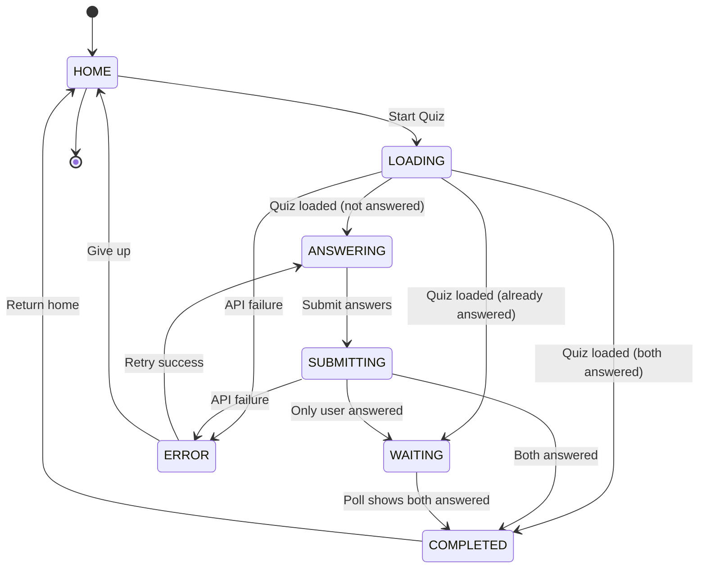

# Classic Quiz - Test Suite Documentation

## Overview

This document describes the comprehensive test suite for verifying the correctness, consistency, and reliability of the Classic Quiz game system.

**Server-Authoritative Architecture:**
- Quiz questions are loaded from server on game start
- Answers submitted to server, match percentage calculated server-side
- LP (30) awarded via `awardLP()` utility on completion
- LP synced via `LovePointService.fetchAndSyncFromServer()` before completion navigation

---

## State Machine

### States

| State | Description |
|-------|-------------|
| HOME | User on home screen, LP counter visible |
| LOADING | Fetching match/quiz data from server |
| ANSWERING | User answering questions |
| SUBMITTING | API call in progress, UI locked |
| WAITING | User answered, waiting for partner |
| COMPLETED | Both answered, showing results |
| ERROR | API error occurred, retry available |

### State Diagram



### Key API Behaviors

| Behavior | Description |
|----------|-------------|
| One quiz per day per type | Same match returned if quiz already exists for date/type |
| Partner joins same match | Partner starting quiz gets same match ID |
| Same questions for both | Both partners see identical questions in same order |
| Match percentage | Calculated as (matching answers / total questions) * 100 |
| LP on completion | 30 LP awarded when second partner submits |

---

## Test Architecture

### API Tests (TypeScript)

**Location:** `api/scripts/tests/quiz/`

**Files:**
- `api/scripts/lib/quiz-test-helpers.ts` - Reusable API utilities
- `api/scripts/tests/quiz/quiz-state-machine.ts` - All 11 test objectives

**Run:**
```bash
cd api
npx tsx scripts/tests/quiz/quiz-state-machine.ts
```

### Chaos Tests (Flutter)

**Location:** `app/test/chaos/`

**Files:**
- `chaos_config.dart` - Fault injection configuration
- `linked_chaos_test.dart` - Chaos tests (shared patterns apply to quiz)

**Run:**
```bash
cd app
flutter test test/chaos/
```

---

## Test Objectives Coverage

| # | Objective | API Test |
|---|-----------|----------|
| 1 | Start quiz creates new match with questions | `quiz-state-machine.ts` |
| 2 | User can submit answers | `quiz-state-machine.ts` |
| 3 | Partner submits to same quiz | `quiz-state-machine.ts` |
| 4 | Match percentage calculated correctly | `quiz-state-machine.ts` |
| 5 | LP awarded on completion (30 LP) | `quiz-state-machine.ts` |
| 6 | LP awarded exactly once (no double-count) | `quiz-state-machine.ts` |
| 7 | Game status polling returns correct state | `quiz-state-machine.ts` |
| 8 | Already answered error on duplicate | `quiz-state-machine.ts` |
| 9 | One quiz per day per type constraint | `quiz-state-machine.ts` |
| 10 | Partner sees same quiz questions | `quiz-state-machine.ts` |
| 11 | Match percentage accuracy (100%, 0%) | `quiz-state-machine.ts` |

---

## High-Risk Areas

1. **LP Double-Counting**
   - Server awards LP on completion, client must NOT call `awardLovePoints()` locally
   - Mitigation: Server-side tracking via `love_point_awards` table with `related_id`

2. **Widget Disposal**
   - Async API calls must check `mounted` before `setState()`
   - Mitigation: Chaos test verifies mounted check pattern

3. **Match ID Consistency**
   - Partner must receive same match ID to answer same quiz
   - Mitigation: Test #10 verifies partner gets same quiz ID

4. **Answer Validation**
   - User cannot submit answers twice
   - Mitigation: Test #8 verifies "Already submitted answers" error

---

## Test Configuration

### Test Users

| User | ID | Role |
|------|----|------|
| TestiY | `c7f42ec5-7c6d-4dc4-90f2-2aae6ede4d28` | Primary test user (user1) |
| Jokke | `d71425a3-a92f-404e-bfbe-a54c4cb58b6a` | Partner user (user2) |

**Couple ID:** `11111111-1111-1111-1111-111111111111`

### API Configuration

| Setting | Value |
|---------|-------|
| Base URL | `http://localhost:3000` |
| LP on completion | 30 |
| Game types | `classic`, `affirmation`, `you_or_me` |

---

## Data Reset

Before running tests, reset couple data:

```bash
# Via API endpoint
curl -X POST http://localhost:3000/api/dev/reset-couple-progress \
  -H "Content-Type: application/json" \
  -H "X-Dev-User-Id: c7f42ec5-7c6d-4dc4-90f2-2aae6ede4d28" \
  -d '{"coupleId": "11111111-1111-1111-1111-111111111111"}'

# Via script
cd api
npx tsx scripts/reset_couple_progress.ts
```

---

## Running All Tests

### Quick Smoke Test

```bash
cd api && npx tsx scripts/tests/quiz/quiz-state-machine.ts
```

### Full Test Suite

```bash
# 1. Start API server
cd api && npm run dev &

# 2. Reset test data
curl -X POST http://localhost:3000/api/dev/reset-couple-progress \
  -H "Content-Type: application/json" \
  -H "X-Dev-User-Id: c7f42ec5-7c6d-4dc4-90f2-2aae6ede4d28" \
  -d '{"coupleId": "11111111-1111-1111-1111-111111111111"}'

# 3. Run Quiz API tests
cd api && npx tsx scripts/tests/quiz/quiz-state-machine.ts

# 4. Run chaos tests
cd app && flutter test test/chaos/
```

---

## File Structure

```
api/
├── app/api/dev/
│   └── reset-couple-progress/
│       └── route.ts                    # Test data reset endpoint
├── app/api/sync/game/
│   ├── [type]/play/route.ts           # Unified game API
│   └── status/route.ts                # Game status endpoint
├── lib/game/
│   └── handler.ts                     # Game state machine logic
├── scripts/
│   ├── lib/
│   │   └── quiz-test-helpers.ts       # Shared test utilities
│   └── tests/
│       └── quiz/
│           └── quiz-state-machine.ts  # API-level tests

app/
└── test/
    └── chaos/
        ├── chaos_config.dart          # Fault injection config
        └── linked_chaos_test.dart     # Chaos tests

docs/
└── QUIZ_TEST_SUITE.md                 # This file
```

---

## Success Criteria

- [x] All 11 test objectives covered
- [x] State machine diagram generated (mermaid)
- [x] LP award verification
- [x] Match percentage accuracy tested
- [x] Duplicate submission prevention verified
- [x] Partner quiz sharing verified
- [x] Run instructions provided

---

## Related Documentation

- `CLAUDE.md` - Main development guide
- `docs/LINKED_POINTS_TEST_SUITE.md` - Linked game test suite (similar pattern)
- `api/lib/lp/config.ts` - LP reward constants
- `api/lib/game/handler.ts` - Server game logic
